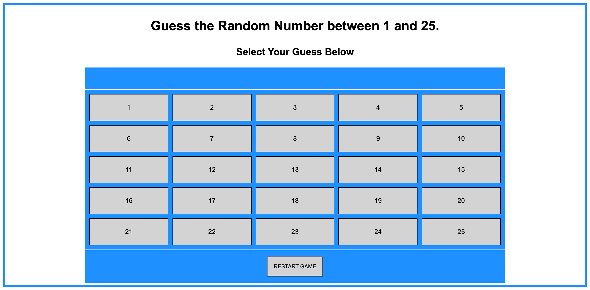
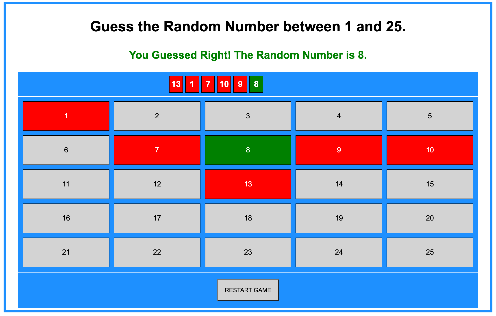
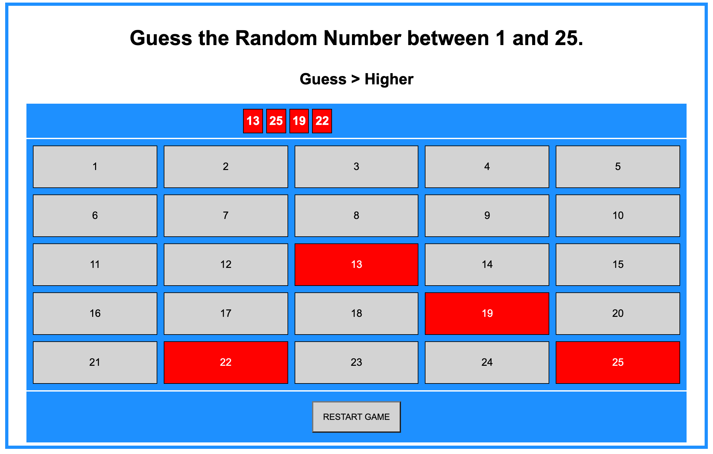
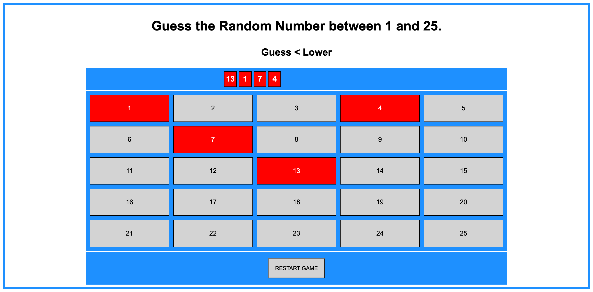
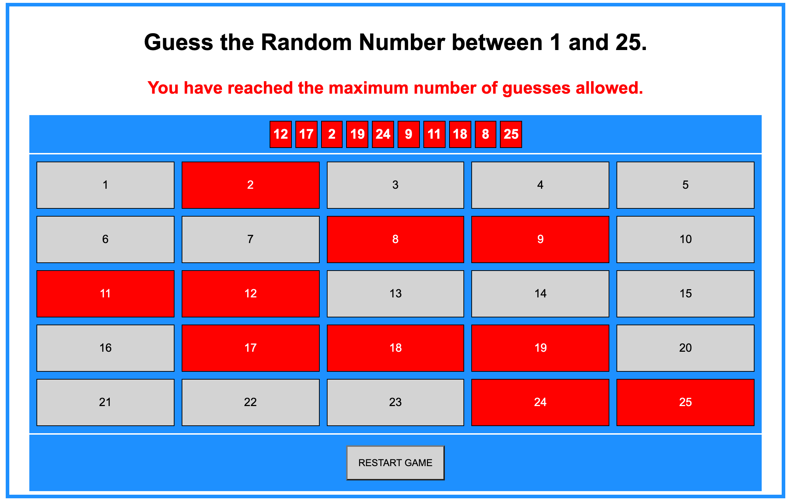

# Grid-Random-Number-Guessing-Game

## Project Overview

A Grid version of Random Number Guessing Game. The user is prompted to select a number between 1 and 25. The program then proceeds to determine if the number selected is the random number, higher than the random number, lower than the random number, or has reached the maximum number of guesses allowed.
## Screenshots

